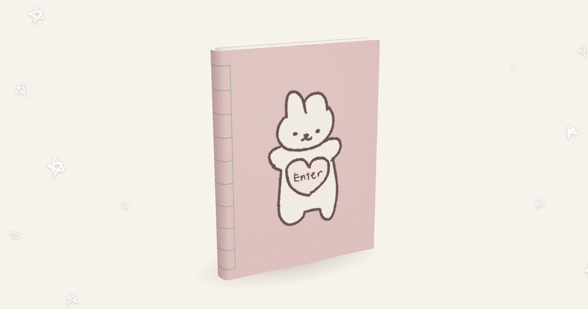

# bookie

A tiny hand-drawn book you can open, turn, and play with.

👉 **[Open bookie](https://nomnao.github.io/)**

## Why I made this

I always wanted a book of my own.
Not one you just read, but one you can play in:
a photo booth, a jar of gummy bears, a typewriter,
all the little things I love, tucked between the pages.

Whoever opens this book,
I hope you have as much fun inside it as I did making it.

I don't write code. Every idea here started as a sketch or a sentence,
and I built it by describing what I wanted, one step at a time.

## The idea

I wanted a website that feels like an object, not a page:
a soft pink book with stitches on the spine, stars drifting in the background,
and small things inside you can actually touch.
Everything is drawn by hand: the bunny, the stars, the tulips.

## How to use it

**Open the book.** Tap the pink "Enter" heart the bunny is holding.
Tap the right page to go forward, the left page to go back.
You can also drag the book to look at it from any angle.

**Page 1 · Photo booth**
Press *Take Photo* (or *Upload Photo*). The booth counts down,
takes four shots, and prints a black-and-white photo strip.
Tap the strip to see it big and save it.
Your browser will ask for camera access. Photos stay on your device.

**Pages 2–3 · Gummy jar**
Tap the lid to open the jar. Pick up a gummy bear and throw it in.
Drag an empty spot to look around; double-tap to reset the view.

**Pages 4–5 · Typewriter**
Just start typing on your keyboard (on a phone, tap the keys).
Press Enter for a new line.
When you're done, press *finish the note*. The paper rolls out,
and you can save it as an image.

🔊 Turn your sound on. The typewriter clicks and dings.
💻 It works best on a computer, especially the typewriter.

## How it's made

- One single `index.html` file, hosted for free on GitHub Pages
- Hand drawings by me
- 3D and physics written from scratch in the browser
- Fonts: Gaegu, Special Elite
- Built with the help of Claude
